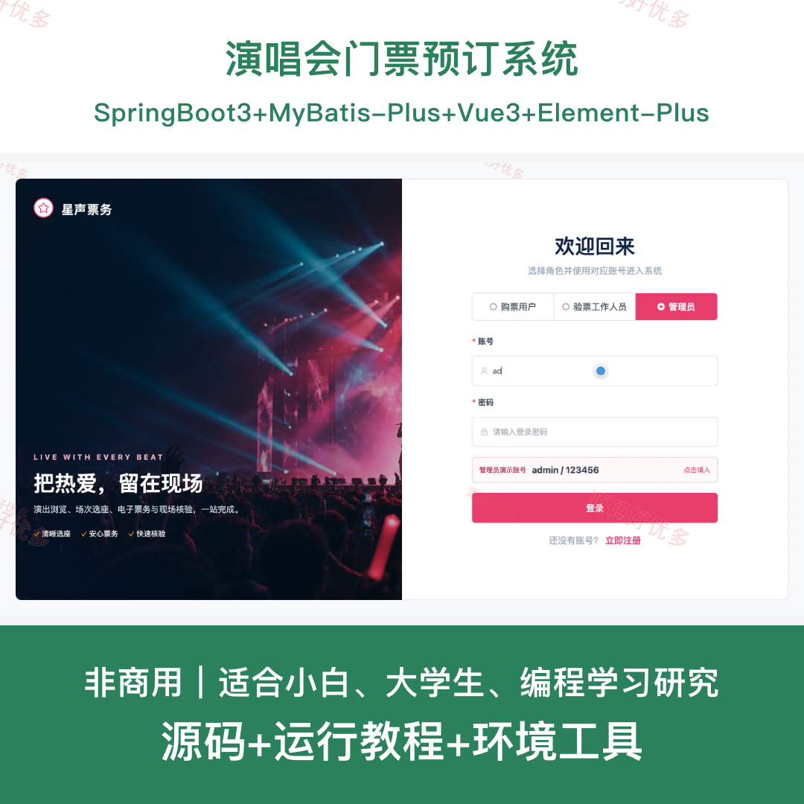
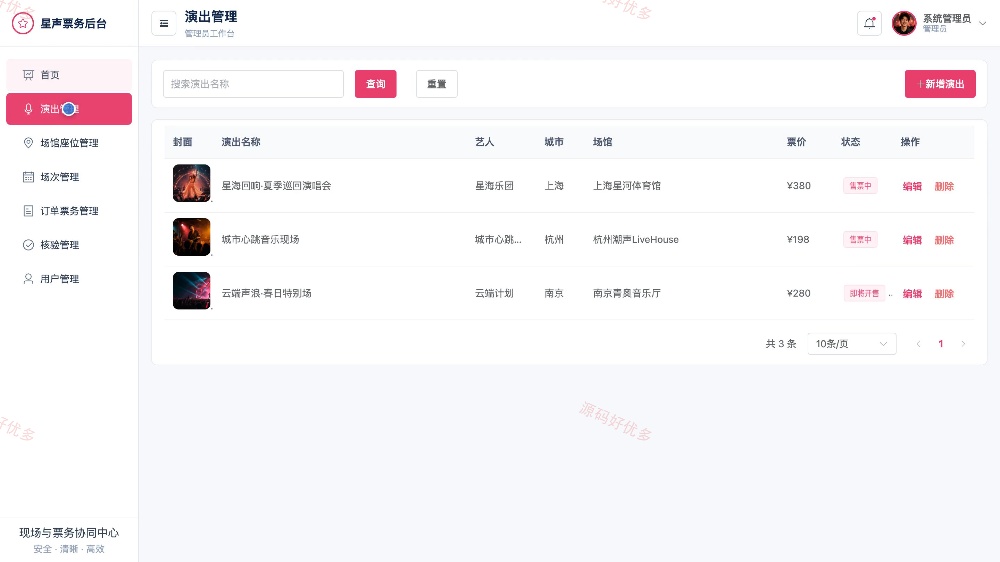
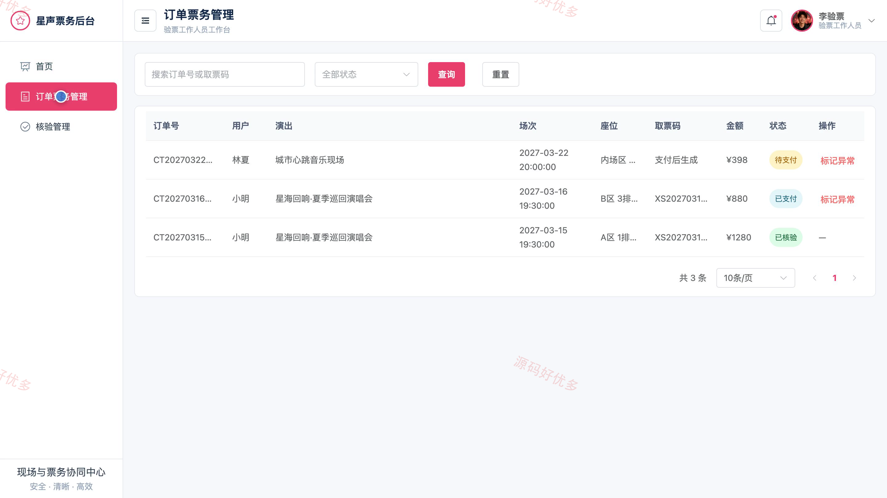
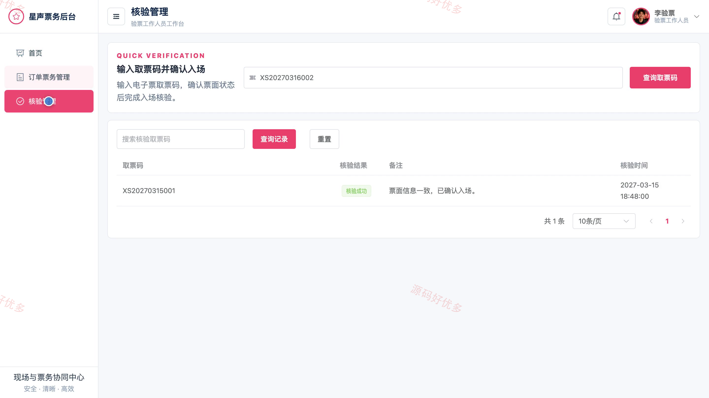

# bs038A
bs038A演唱会门票预订系统
## 源码问题查看主页咨询

### 一、关键词
演唱会订票、在线选座、电子票务、演出票务、入场核验

### 二、作品包含
源码+数据库+全套环境和工具资源+本地部署教程

### 三、项目技术
前端技术： Html、Css、Js、Vue3.4、Element-Plus
后端技术：Java、SpringBoot3.2.0、MyBatis-Plus

### 四、运行环境（以下版本亲测，其他版本兼容性请自行测试）
开发工具：IDEA/eclipse + VSCODE

数据库：MySQL5.7+（共10张表）

数据库管理工具：Navicat10以上版本

环境配置软件： JDK17 + Maven

前端Nodejs：16+

浏览器：谷歌浏览器

### 五、项目介绍
项目编号：bs038A

演唱会门票预订系统面向购票用户、验票工作人员和管理员，围绕演出浏览、场次选座、模拟支付、电子票生成、取票码核验与后台运营形成完整票务流程。

角色：购票用户、验票工作人员、管理员

购票用户功能：账号注册登录、演出浏览与收藏、场次与座位选择、订单提交与模拟支付、电子票与取票码查看、我的票务查询。

验票工作人员功能：场次票务查看、订单票务查询、取票码核验、核验记录查看、异常票务处理。

管理员功能：业务数据看板、购票用户与工作人员管理、演出信息管理、场馆座位管理、演出场次管理、订单票务管理、核验记录管理。

### 六、运行截图

